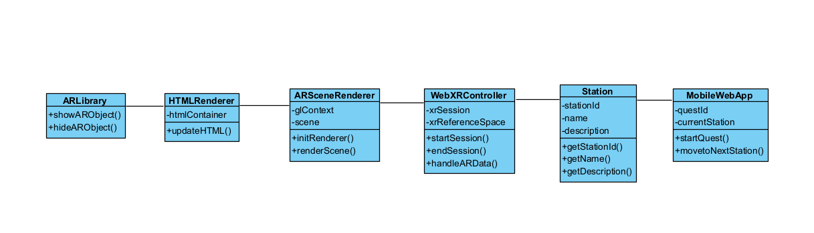

# Анализ-репорт проекта "Квест по станциям"

## Описание проекта
Целью проекта "Квест по станциям" является создание мобильного web-приложения с использованием технологии дополненной реальности (AR). Приложение представляет собой квест, в котором пользователи перемещаются между различными станциями, выполняя задания на каждой станции.

## Методы разработки
Для разработки приложения будет использован следующий подход:
- Итеративная разработка: Разработка будет выполняться путем последовательного добавления и улучшения функциональности в каждой итерации.

## Инструменты проектирования
Для разработки мобильного web-приложения "Квест по станциям" будут использованы следующие инструменты:
- HTML и CSS: Для создания структуры и визуального оформления веб-приложения.
- JavaScript: Для создания логики приложения и взаимодействия с WebXR API.
- WebXR API: Набор JavaScript-интерфейсов, предоставляющих функции для работы с сенсорными данными, отображения 3D-сцен и взаимодействия с объектами AR.
- WebGL: API для рендеринга 3D-графики в браузере, используется для отображения сцен дополненной реальности.
- Библиотеки (например, A-Frame, AR.js и Three.js): Предоставляют готовые компоненты и функциональность для работы с AR.
- Среда разработки - WebStorm.

## Диаграмма классов
Ниже представлена диаграмма классов, предварительно описывающая основные классы в приложении:

### MobileWebApp
Класс представляет мобильное веб-приложение для квеста по станциям. Он содержит информацию о текущем квесте и текущей станции. Класс обеспечивает функциональность запуска квеста и перехода к следующей станции.

### Station
Класс представляет станцию в квесте. Он содержит информацию о идентификаторе станции, ее названии и описании. Класс предоставляет методы для получения идентификатора, названия и описания станции.

### WebXRController
Класс представляет контроллер WebXR для взаимодействия с дополненной реальностью. Он содержит информацию о текущей сессии WebXR и ссылку на пространство отображения. Класс предоставляет методы для запуска и завершения сессии WebXR, а также для обработки данных AR.

### ARSceneRenderer
Класс представляет рендерер сцены дополненной реальности. Он содержит контекст WebGL и объект сцены. Класс предоставляет методы для инициализации рендерера и отображения сцены.

### HTMLRenderer
Класс представляет рендерер HTML-контента в приложении. Он содержит ссылку на контейнер HTML. Класс предоставляет метод для обновления HTML-контента.

### ARLibrary
Класс представляет библиотеку дополненной реальности.